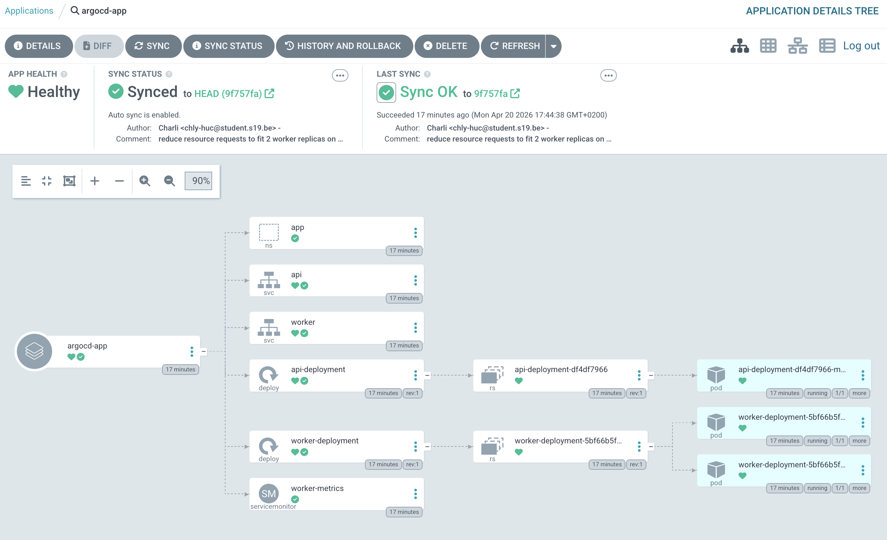
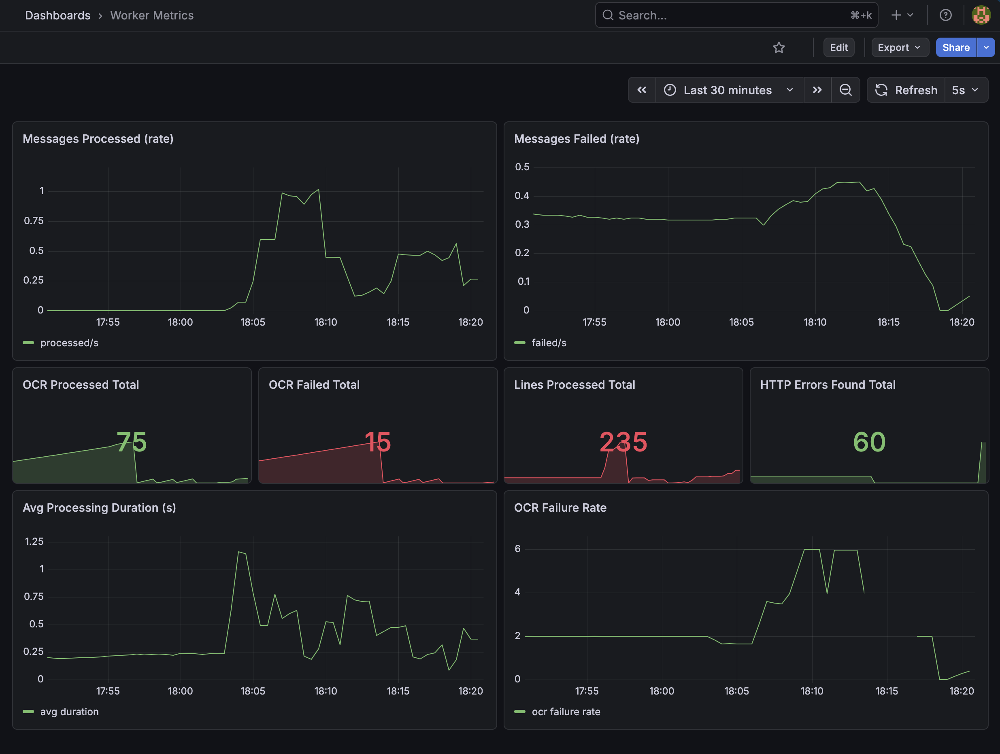
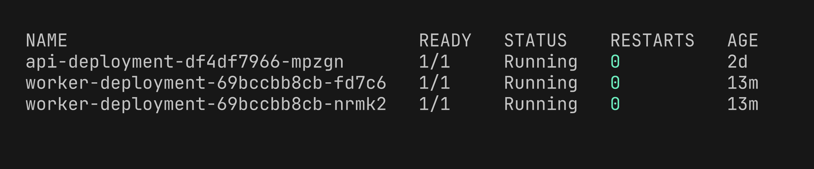

# k8s-prod

Production-ready log processing system running on Kubernetes. Upload log files or images — the worker parses them, extracts HTTP metrics, and stores results in S3. Full observability via Prometheus + Grafana.

## Architecture

```
User → POST /upload → API → S3 (raw file) + SQS (job message)
                               ↓
                           Worker (polls SQS)
                               ↓
                     S3 (results/job_id/summary.json)
                               ↓
                     GET /jobs/{job_id} → result
```

```
┌─────────────────────────────────────────────────────┐
│  Kubernetes (Minikube)                              │
│                                                     │
│  ┌─────────┐    ┌──────────┐    ┌───────────────┐  │
│  │   API   │    │  Worker  │───▶│  Prometheus   │  │
│  │ FastAPI │    │ (×2 pods)│    │  + Grafana    │  │
│  └────┬────┘    └────┬─────┘    └───────────────┘  │
│       │              │                              │
└───────┼──────────────┼──────────────────────────────┘
        │              │
   ┌────▼──────────────▼────┐
   │     LocalStack         │
   │   S3  │  SQS           │
   └────────────────────────┘
```

## Screenshots

### ArgoCD — apps synced and healthy


### Grafana — worker metrics dashboard


### Pods running


### API in action


## Features

- **FastAPI** — upload endpoint, job status polling, health check
- **Worker** — SQS consumer with log parsing and OCR support (Tesseract)
- **OCR** — send images of logs, worker extracts text and parses them
- **Prometheus metrics** — messages processed/failed, OCR stats, processing duration
- **Terraform** — provisions S3 + SQS on LocalStack
- **Multi-arch Docker builds** — `linux/amd64` + `linux/arm64`
- **Non-root containers** — runs as `appuser` (uid 1001)
- **Snyk scanning** — container vulnerability scanning in CI

## Repo Structure

```
app/
  api/          # FastAPI service
  worker/       # SQS consumer + OCR + Prometheus metrics
terraform/
  modules/aws/  # S3 and SQS modules
  environments/dev/
.github/workflows/ci.yaml  # Build, push, scan
```

Kubernetes config lives in a separate repo: [k8s-prod-config](https://github.com/4b93f-organization/k8s-prod-config)

## Worker Metrics

| Metric | Description |
|--------|-------------|
| `worker_messages_processed_total` | Successfully processed messages |
| `worker_messages_failed_total` | Failed messages |
| `worker_lines_processed_total` | Log lines parsed |
| `worker_http_errors_found_total` | 4xx/5xx errors found |
| `worker_ocr_processed_total` | Images processed via OCR |
| `worker_ocr_failed_total` | OCR failures |
| `worker_processing_duration_seconds` | Processing time histogram |

## CI/CD

GitHub Actions on every push to `main` (when `app/` files change):

1. Build + push multi-arch Docker images to GHCR
2. Snyk dependency scan
3. Snyk container image scan

Kubernetes deployment is handled by ArgoCD via [k8s-prod-config](https://github.com/4b93f-organization/k8s-prod-config) — push to that repo, cluster updates automatically.

## Local Setup

### Prerequisites

| Tool | Purpose |
|------|---------|
| [Minikube](https://minikube.sigs.k8s.io/) | Local Kubernetes cluster |
| [kubectl](https://kubernetes.io/docs/tasks/tools/) | Kubernetes CLI |
| [Helm](https://helm.sh/docs/intro/install/) | Chart management |
| [ArgoCD CLI](https://argo-cd.readthedocs.io/en/stable/cli_installation/) | ArgoCD CLI |
| [LocalStack](https://docs.localstack.cloud/getting-started/installation/) | Local AWS (S3 + SQS) |
| [Terraform](https://developer.hashicorp.com/terraform/install) | Provision AWS resources |

### 1. Start Minikube

```bash
minikube start
```

### 2. Install ArgoCD

```bash
kubectl create namespace argocd
kubectl apply -n argocd -f https://raw.githubusercontent.com/argoproj/argo-cd/stable/manifests/install.yaml
kubectl wait --for=condition=available deployment/argocd-server -n argocd --timeout=120s
```

### 3. Clone the config repo and deploy monitoring first

> **Important:** deploy monitoring before the app — the app chart includes a ServiceMonitor which requires Prometheus CRDs to exist first.

```bash
git clone https://github.com/4b93f-organization/k8s-prod-config
cd k8s-prod-config

kubectl apply -f argocd/monitor.yaml
```

Wait for kube-prometheus-stack to finish syncing (installs the CRDs):

```bash
kubectl get pods -n monitoring --watch
# wait until prometheus-operator pod is Running
```

### 4. Deploy the app

```bash
kubectl apply -f argocd/application.yaml
```

### 5. Start LocalStack and provision AWS resources

```bash
# Start LocalStack (requires auth token from app.localstack.cloud)
localstack start

# In the k8s-prod repo
cd terraform/environments/dev
cp terraform.tfvars.example terraform.tfvars
# Edit terraform.tfvars — add your LocalStack auth token

terraform init
terraform apply
```

### 6. Access services

```bash
# Get Minikube IP
minikube ip

# API (NodePort — check values.yaml for port)
curl http://$(minikube ip):30080/health

# Grafana
open http://$(minikube ip):30300
# default login: admin / prom-operator

# ArgoCD UI
kubectl port-forward svc/argocd-server -n argocd 8080:443
open https://localhost:8080
# password: kubectl -n argocd get secret argocd-initial-admin-secret -o jsonpath="{.data.password}" | base64 -d
```

### 7. Test the API

```bash
API=http://$(minikube ip):30080

# Upload a log file
curl -X POST $API/upload -F "file=@log/test.log"
# → {"job_id": "...", "status": "queued"}

# Upload an image (OCR)
curl -X POST $API/upload -F "file=@screenshot.png"

# Check result
curl $API/jobs/<job_id>
```

## API Reference

| Method | Path | Description |
|--------|------|-------------|
| `GET` | `/health` | Health check |
| `POST` | `/upload` | Upload log file or image |
| `GET` | `/jobs/{job_id}` | Get job result |
